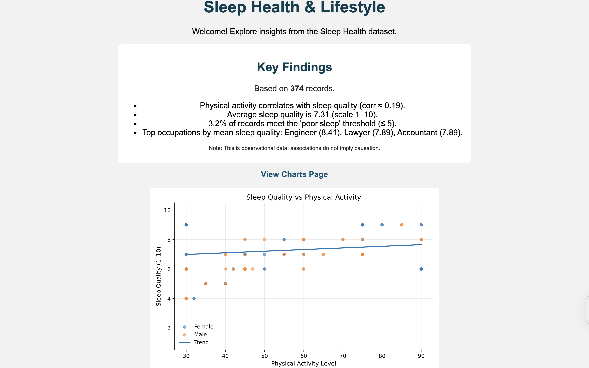
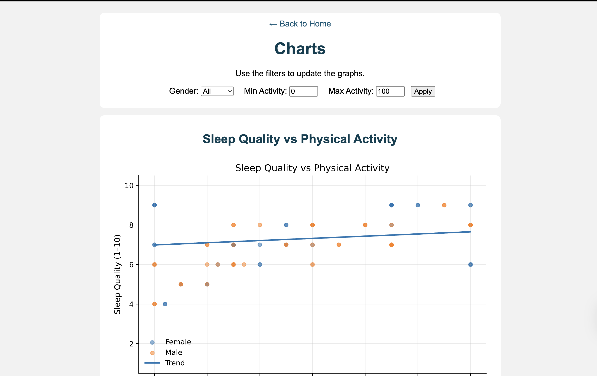

# Sleep Health & Lifestyle Dashboard

**Health-focused data analytics project built with Python and Flask**

This project explores relationships between lifestyle factors (physical activity, stress, occupation) and sleep outcomes using an interactive web dashboard. It was built as a **portfolio project for data analyst and data science internships**, emphasizing applied analysis, experimentation, and clear communication of insights.

Dataset source: Sleep Health and Lifestyle Dataset from Kaggle
# https://www.kaggle.com/datasets/uom190346a/sleep-health-and-lifestyle-dataset

---

## Project Overview

- Built a **Flask web application** to analyze and visualize sleep health data  
- Designed **interactive dashboards** with query-parameter filtering  
- Exposed **raw data views** (HTML table + JSON endpoint)  
- Implemented a basic **A/B testing mechanism** to compare user interactions  
- Summarized insights and limitations for **non-technical audiences**

This project mirrors a small **analytics product**, not just exploratory coursework.

---

## Dashboard Preview




---

## Key Features

### Interactive Analysis
- **Sleep Quality vs Physical Activity** visualization with filters  
- **Ranked comparison of occupations** by mean sleep quality  
- Dedicated **`/charts` page** for exploration  

### Raw Data Access
- **HTML table view** for manual inspection (`/browse.html`)  
- **JSON endpoint** for programmatic access (`/browse.json`)  
- Optional filtering via query parameters  

### Experimentation (A/B Testing)
- Simple **A/B test** that serves different versions of a call-to-action  
- Tracks interaction counts to determine which variant performs better  
- Demonstrates foundational **experimentation and decision logic**

### Summary Metrics
- Average sleep quality and duration  
- Proportion of records meeting a **“poor sleep” threshold**  
- Notable correlations between lifestyle factors and sleep outcomes  
> This dataset is observational; associations do not imply causation.

---

## Example Findings

- Higher physical activity levels are **positively associated** with sleep quality  
- Sleep outcomes vary meaningfully across occupations  
- A non-trivial portion of the dataset meets a defined “poor sleep” threshold  

---

## Tech Stack

- **Python**
- **Flask**
- **pandas**
- **NumPy**
- **Matplotlib**
- **HTML/CSS** (lightweight frontend)

---

## Running the Project Locally

```bash
pip install -r requirements.txt
python3 main.py
